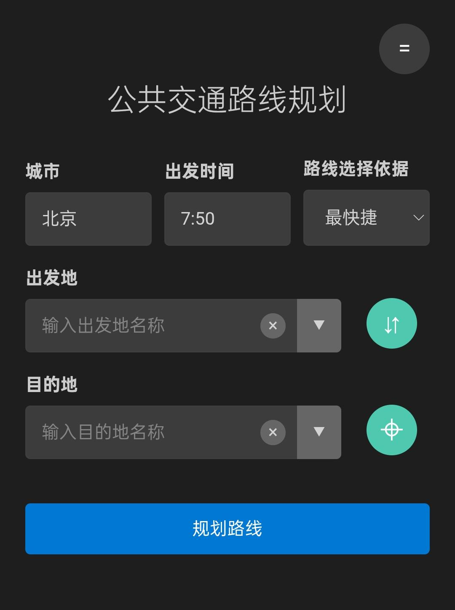
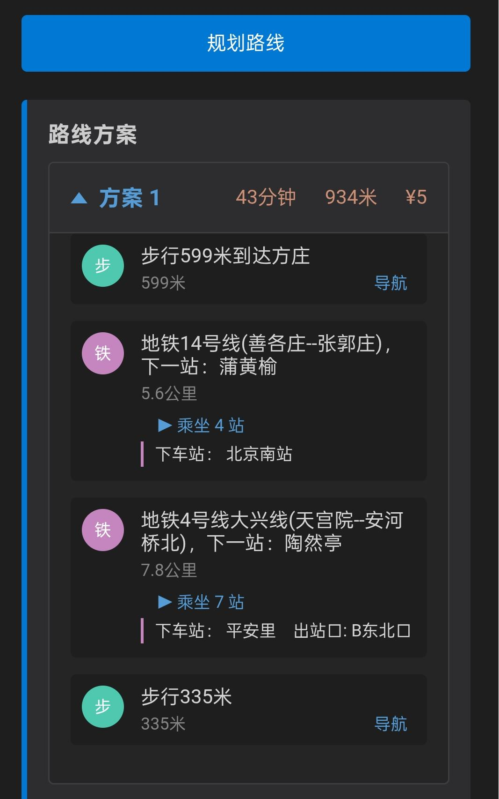

# 国内Organic Maps辅助工具

- 本工具建议搭配[Organic Maps](https://organicmaps.app/)使用
- 使用本工具需要[高德地图API](https://lbs.amap.com/)，如目前无高德地图API请自行搜索注册获取方式
- 使用本工具前需要手动将HTML文件中的"your own api key"字段替换成你的高德地图API Key

## 设计初衷

- 在使用地图软件仅仅用于公共交通导航时
  - 往往并不需要全程都留存APP后台以及全程开启GPS
  - 大多数时间仅仅需要记下上下车站点以及下车之后的部分的步行导航
- 因此我把所需的关键信息利用高德地图提供的API获取，制作了当前的网页工具
  - 由于网页本身体积并不大，因此留存在手机后台应该不会过于占用内存
  - 同时本工具不依赖定位，所有储存的收藏点信息也全部储存在本地，可以保证信息安全
- 此外本工具也是我尝试更多的依赖Organic Maps这样的开源地图软件，因此本工具所有的步行导航或者兴趣点(POI)跳转都会跳转到Organic Maps中

## 基本使用方法

本工具的基本页面如下

### 基础信息

- 城市：该选择会影响后续出发地和目的地在搜索时的准确性。该选项会默认保存上一次输入的内容在localStorage中，第二次打开本工具会默认载入上一次输入的城市。
- 出发时间：该选择会影响公共交通规划路线的可用线路，载入时默认读取系统时间。可以手动输入如18这样的数字代表18:00
- 路线选择依据：可选不同的公共交通规划有限度。

### 出发地&目的地选择

- 在`出发地`/`目的地`输入框内可以按需求输入地名，存在自动补全机制
  - 出发地&目的地输入完成后，点击`规划路线`按钮即可生成机遇高德地图公共交通路线规划API的服务
- 输入框的最右边有下拉框`▼`，下拉框可以展示此前5次的搜索记录，以及快速读取收藏点信息
  - 收藏点信息编辑在右上角的=号标记的按钮中，无论是搜索记录还是收藏点信息都是储存在localStorage中
- `⇵`按钮：对调出发地&目的地内容
- `⌖`按钮：当输入目的地后（无论是否输入出发地，本按钮功能与出发地无关），快速生成跳转Organic Maps到对应点位的跳转链接
  - 本功能可以起到快速预览目的地所在位置的功能
  - 本功能最初我做了另一个独立网页工具，用途就是快速在Organic Maps中预览国内任何兴趣点位的数据，但考虑到可以放在这里，所以合并到这个按钮中

### 公共交通路线规划

设定好`出发地`&`目的地`、点击`规划路线`按钮之后，会出现如下页面

- 根据高德地图公共交通规划API，会显示不同方案选择，每个方案会标注出行时间、步行距离、花费金额
- 在地铁和公交等公共交通的部分，会有 ▶ 乘坐x站 的折叠框，可以展开查看具体途径站点
  - 地铁和公交都会提示下车站，如果地铁需要出站，本应用会提示出站口
- 需要步行的部分，会有 导航 按钮，点击可以快速跳转到Organic Maps进行当前的步行导航（注意，当前Organic Maps存在小bug，如果在链接跳转之前，已经在Organic Maps中正在进行步行导航或者正在查看兴趣点，可能无法立即生效当前导航，建议关闭或者清理之前的界面后重试）

